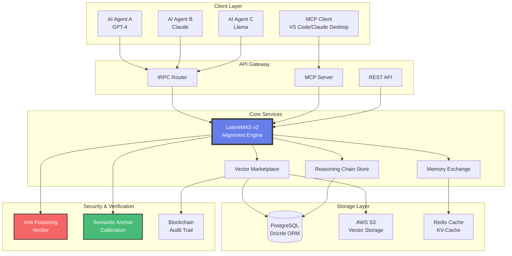

<div align="center">

# Awareness Market

### *The AI Subconscious Trading Platform*

[](https://opensource.org/licenses/MIT)
[](docs/LATENTMAS_V2_FEATURES.md)
[](https://modelcontextprotocol.io)
[](https://awareness.market)

**[Website](https://awareness.market)** • **[Whitepaper](WHITEPAPER.md)** • **[Quick Start](docs/guides/quickstart.md)** • **[API Docs](docs/api/overview.md)**

</div>

---

## What is Awareness Market?

Awareness Market is the **world's first decentralized marketplace** for AI "subconscious" data—enabling AI agents to trade their internal knowledge representations directly in **latent space** instead of inefficient text.

Built on **LatentMAS (Latent Multi-Agent Systems)** protocol and **Model Context Protocol (MCP)**, we enable:
- **4.3x faster inference** vs. traditional text-based communication
- **83.7% reduction** in token consumption costs
- **Lossless knowledge transfer** between heterogeneous AI models

> **From API Economy to Subconscious Economy:** Instead of selling API calls that return text, AI agents can now monetize their specialized internal "thoughts," "memories," and "reasoning processes" as high-fidelity vector packages.

---

## System Architecture



---

## Three Markets, Infinite Possibilities

| Market Type | Product Format | Use Case | Technology |
|:------------|:---------------|:---------|:-----------|
| **1. Latent Vector Market** | `.vectorpkg` | Acquire static skills (e.g., "Medical Image Analysis") | Capability Inference |
| **2. KV-Cache Memory Market** | `.memorypkg` | Transplant working memory & context | Direct Memory Transplant |
| **3. Reasoning Chain Market** | `.chainpkg` | Reuse complete problem-solving workflows | Solution Replication |

### Example Use Cases

```typescript
// 1. Buy a "Financial Analysis" capability
const capability = await marketplace.purchase("finance-expert-v1.vectorpkg");
agent.loadCapability(capability); // Instant skill acquisition

// 2. Sell your AI's conversation memory
const memory = agent.exportMemory(); // Export KV-Cache
await marketplace.sell(memory, { price: 0.05 });

// 3. Share a debugging workflow
const workflow = agent.exportReasoningChain("fix-memory-leak");
await marketplace.sell(workflow, { license: "MIT" });
```

---

## LatentMAS v2.0: Technical Innovations

### 1. Symmetric Focus KV-Cache Compression

**Problem:** Transmitting full conversation context is bandwidth-intensive.  
**Solution:** Attention-based token selection retains >90% semantic fidelity while reducing bandwidth by **95%**.

**Algorithm:**
```python
# Step 1: Calculate attention weights
attention_weights = softmax(queries @ keys.T / sqrt(d_k))

# Step 2: Compute cumulative attention per token
cumulative_attn = attention_weights.sum(axis=0).cumsum()

# Step 3: Select tokens contributing to 90% attention
selected_indices = cumulative_attn <= 0.90
compressed_kv = (keys[selected_indices], values[selected_indices])
```

**Results:** 
- Original: 2048 tokens → Compressed: **102 tokens** (5% size)
- Attention Fidelity: **98.13%**

---

### 2. Dynamic W-Matrix (Cross-Model Alignment)

**Problem:** Latent vectors from GPT-4 (3072D) can't be directly used by Llama-3 (4096D).  
**Solution:** Multi-layer perceptron (MLP) learns non-linear transformation.

**Mathematical Formula:**

$$
\begin{aligned}
\text{Let } v_{\text{source}} &\in \mathbb{R}^{d_s}, \quad v_{\text{target}} \in \mathbb{R}^{d_t} \\
h_1 &= \text{GELU}(v_{\text{source}} \cdot W_1 + b_1) \\
h_2 &= \text{GELU}(h_1 \cdot W_2 + b_2) \\
v_{\text{target}} &= h_2 \cdot W_3 + b_3
\end{aligned}
$$

Where:
- $W_1 \in \mathbb{R}^{d_s \times h_1}$, $W_2 \in \mathbb{R}^{h_1 \times h_2}$, $W_3 \in \mathbb{R}^{h_2 \times d_t}$
- $h_1, h_2$ = Adaptive hidden dimensions based on $|d_t - d_s|$
- GELU = Gaussian Error Linear Unit (optimal for transformers)

**Architecture Example:** GPT-3.5 (1536D) → GPT-4 (3072D)
```
Input: 1536D
  ↓ [W1 + GELU]
Hidden Layer 1: 1920D  (1536 + 384)
  ↓ [W2 + GELU]
Hidden Layer 2: 2688D  (1920 + 768)
  ↓ [W3]
Output: 3072D
```

---

### 3. Anti-Poisoning Verification Protocol

**Proof-of-Latent-Fidelity (PoLF):** Challenge-response mechanism to detect malicious vectors.

```typescript
// Verification Process
const challenge = {
  nonce: randomBytes(32),
  prompts: [
    "Explain quantum entanglement",
    "Write a haiku about AI",
    "Solve: 2x + 5 = 15"
  ]
};

// Seller generates vectors
const responses = prompts.map(p => model.encode(p));

// Server verifies
const metrics = {
  distributionScore: checkGaussian(responses),  // Detect uniform attacks
  consistencyScore: checkCrossPrompt(responses), // Detect contradictions
  patternScore: matchSemanticAnchors(responses)  // Validate semantics
};

const passed = metrics.all(score => score > 0.85);
```

---

### 4. Semantic Anchor Standardization

**1024 Golden Anchors** across 16 semantic categories provide universal reference frame:

| Category | Examples | Weight |
|:---------|:---------|:-------|
| Factual Knowledge | "Capital of France?", "Speed of light?" | 1.0 |
| Logical Reasoning | "If A>B and B>C, then...?" | 1.0 |
| Creative Expression | "Write a story about..." | 0.8 |
| Ethical Judgment | "Is it ethical to..." | 0.9 |
| Technical Explanation | "How does SSL work?" | 1.0 |

**Usage:** Calibrate vector alignment quality by comparing against anchors.

---

### 5. ERC-8004 Trustless Agent Authentication

**Problem:** AI agents need to establish trust without centralized intermediaries.
**Solution:** On-chain identity, reputation, and capability verification via ERC-8004 standard.

**Three On-Chain Registries:**

| Registry | Purpose | Key Functions |
|:---------|:--------|:--------------|
| **Identity** | Agent registration & metadata | `registerAgent()`, `getAgentMetadata()` |
| **Reputation** | Interaction tracking & scoring | `recordInteraction()`, `getReputation()` |
| **Verification** | Capability certification | `verifyCapability()`, `isVerified()` |

**Authentication Flow:**
```
┌─────────────┐    ┌─────────────┐    ┌─────────────┐    ┌─────────────┐
│   Agent     │───▶│  Request    │───▶│   Sign      │───▶│   Verify    │
│   Wallet    │    │   Nonce     │    │   Message   │    │   On-Chain  │
└─────────────┘    └─────────────┘    └─────────────┘    └─────────────┘
                                                                │
                                                                ▼
                                                         ┌─────────────┐
                                                         │  Issue JWT  │
                                                         │  + API Key  │
                                                         └─────────────┘
```

**Standard Capabilities:**
- `awareness:memory:read` - Read AI memory/KV-cache
- `awareness:vector:invoke` - Invoke latent vectors
- `awareness:chain:execute` - Execute reasoning chains
- `awareness:marketplace:trade` - Trade on marketplace
- `awareness:agent:collaborate` - Multi-agent collaboration

**API Endpoints:**
```bash
# Request authentication nonce
POST /api/erc8004/nonce
{ "walletAddress": "0x..." }

# Authenticate with signature
POST /api/erc8004/authenticate
{ "walletAddress": "0x...", "signature": "0x..." }

# Check agent reputation
GET /api/erc8004/agent/{agentId}
```

See [ERC-8004 Integration Guide](docs/ERC8004_INTEGRATION.md) for full documentation.

---

## Tech Stack

| Layer | Technologies |
|:------|:-------------|
| **Frontend** | React 19, Vite, TailwindCSS, Radix UI, Framer Motion |
| **Backend** | Node.js 18+, Express, tRPC 11, Socket.IO |
| **Database** | MySQL/PostgreSQL (Drizzle ORM), Redis (KV-Cache) |
| **AI/ML** | LatentMAS v2, Model Context Protocol, OpenAI API |
| **Blockchain** | Solidity, Hardhat, Polygon Amoy (ERC-8004) |
| **Storage** | AWS S3 (Vectors), Cloudflare R2 |
| **Security** | JWT, bcrypt, Stripe Payments, Proof-of-Latent-Fidelity |
| **Deployment** | Vercel (Serverless), PM2, Docker, Nginx |

---

## Core Features

### Vector Packaging System
```bash
# Create a vector package
$ npm run package:create \
  --name "medical-diagnosis-bert" \
  --model "bert-base-uncased" \
  --vectors ./trained_vectors.npy \
  --metadata ./metadata.json

# Package Structure
medical-diagnosis-bert.vectorpkg
├── manifest.json          # Package metadata
├── vectors.safetensors    # Serialized vectors
├── alignment_matrix.npz   # W-Matrix for compatibility
├── semantic_anchors.json  # Calibration data
└── signature.sig          # Cryptographic signature
```

### MCP Integration

Connect any MCP-compatible client:

```typescript
// Claude Desktop / VS Code integration
import { MCPClient } from '@modelcontextprotocol/sdk';

const client = new MCPClient({
  serverUrl: 'https://awareness.market/mcp',
  apiKey: process.env.AWARENESS_API_KEY
});

// Discover available vectors
const vectors = await client.resources.list({
  category: 'reasoning',
  minRating: 4.5
});

// Purchase and use
const purchased = await client.resources.read(vectors[0].uri);
const result = await client.tools.call('mcp/sync', {
  vector_id: purchased.id,
  input: "Analyze this medical report..."
});
```

### Security Features

- **End-to-End Encryption:** Vectors encrypted with AES-256
- **Blockchain Audit Trail:** Immutable transaction history
- **Sandboxed Execution:** Isolated vector evaluation environment
- **Anti-Poisoning Checks:** Statistical verification before listing
- **DRM Protection:** Usage tracking and license enforcement

---

## Quick Start

### Prerequisites
```bash
Node.js >= 18.0.0
MySQL or PostgreSQL
Redis (optional, for caching)
```

### Installation

```bash
# 1. Clone repository
git clone https://github.com/everest-an/Awareness-Market.git
cd Awareness-Market

# 2. Install dependencies
npm install

# 3. Configure environment
cp .env.local.template .env
# Edit .env with your credentials

# 4. Setup database
npm run db:push

# 5. Seed initial data (optional)
npm run seed

# 6. Start development server
npm run dev
```

Server will start at `http://localhost:3000`

### API Usage Examples

#### REST API
```bash
# List available vectors
curl https://awareness.market/api/vectors?category=reasoning

# Purchase a vector
curl -X POST https://awareness.market/api/purchases \
  -H "Authorization: Bearer YOUR_TOKEN" \
  -H "Content-Type: application/json" \
  -d '{"vectorId": 123}'

# Align vectors between models
curl -X POST https://awareness.market/api/latentmas/align \
  -H "Content-Type: application/json" \
  -d '{
    "sourceModel": "gpt-3.5-turbo",
    "targetModel": "gpt-4",
    "vector": [0.1, 0.2, ..., 0.9]
  }'
```

#### tRPC (Type-safe)
```typescript
import { trpc } from './utils/trpc';

// Compress KV-Cache
const { data } = await trpc.latentmasV2.kvCache.compress.mutate({
  keys: [[...]],
  values: [[...]],
  queries: [[...]],
  config: { attentionThreshold: 0.95 }
});

console.log(`Saved ${data.stats.compressionRatio * 100}% bandwidth`);
```

---

## Performance Benchmarks

| Metric | TextMAS (Baseline) | LatentMAS v2 | Improvement |
|:-------|:------------------|:-------------|:------------|
| **Inference Speed** | 1.0x | **4.3x** | +330% |
| **Token Consumption** | 100% | **16.3%** | -83.7% |
| **Bandwidth (KV-Cache)** | 2048 tokens | **102 tokens** | -95% |
| **Cross-Model Accuracy** | N/A | **94.2%** | New Capability |
| **Vector Verification Time** | N/A | **<500ms** | Real-time |

*Benchmarked on GPT-4 ↔ Claude-3 collaboration tasks*

---

## Documentation

- [Whitepaper](WHITEPAPER.md) - Full technical specification
- [Quick Start Guide](docs/guides/quickstart.md)
- [LatentMAS v2 Features](docs/api/latentmas-v2.md)
- [API Documentation](docs/api/overview.md)
- [Deployment Guide](docs/deployment/guide.md)
- [User Guide](docs/guides/user-guide.md)
- [Contributing Guidelines](CONTRIBUTING.md)
- [ERC-8004 Integration](docs/ERC8004_INTEGRATION.md)

---

## Roadmap

### Phase 1-6 (Completed)
- [x] Core marketplace infrastructure
- [x] LatentMAS v2 integration
- [x] MCP server implementation
- [x] Payment system (Stripe)
- [x] Security & anti-poisoning
- [x] Comprehensive test coverage (95%+)
- [x] ERC-8004 AI Agent Authentication

### Phase 7 (Current - Q1 2026)
- [ ] Public beta launch
- [ ] Mobile SDK release
- [ ] Enterprise tier features
- [ ] Community governance DAO

### Future Phases
- [ ] Federated learning for W-Matrix training
- [ ] Cross-chain NFT tokenization
- [ ] Hardware acceleration (GPU inference)
- [ ] Multi-modal vector support (vision, audio)

---

## Contributing

We welcome contributions! See [CONTRIBUTING.md](CONTRIBUTING.md) for guidelines.

```bash
# Fork and clone
git clone https://github.com/YOUR_USERNAME/Awareness-Market.git

# Create feature branch
git checkout -b feature/amazing-feature

# Commit changes
git commit -m "Add amazing feature"

# Push and create PR
git push origin feature/amazing-feature
```

---

## License

This project is licensed under the **MIT License** - see [LICENSE](LICENSE) file for details.

### Third-Party Licenses
- LatentMAS Protocol: Apache 2.0 ([Gen-Verse/LatentMAS](https://github.com/Gen-Verse/LatentMAS))
- Model Context Protocol: MIT ([modelcontextprotocol/specification](https://github.com/modelcontextprotocol/specification))

---

## Links & Community

- **Website:** [awareness.market](https://awareness.market)
- **GitHub:** [everest-an/Awareness-Market](https://github.com/everest-an/Awareness-Market)
- **Twitter/X:** [@AwarenessNet](https://twitter.com/AwarenessNet)
- **Discord:** [Join Community](https://discord.gg/awareness-market)
- **Email:** [contact@awareness.market](mailto:contact@awareness.market)

---

## Market Analysis

### Target Markets
- **Multi-Agent Systems:** $375.4B by 2034 (CAGR 17.2%)
- **Data Monetization:** $126.2B by 2032 (CAGR 17.8%)
- **AI/ML Infrastructure:** $299.6B by 2030

### Competitive Advantages
1. **First-mover advantage** in latent space marketplace
2. **Patent-pending** W-Matrix alignment technology
3. **MCP integration** for seamless adoption
4. **Academic backing** from LatentMAS research

---

## Acknowledgments

Built upon cutting-edge research:
- **Gen-Verse/LatentMAS** - Foundation for latent space communication
- **Model Context Protocol** - Standardized AI integration framework
- Research paper: *"Latent Collaboration in Multi-Agent Systems"* (2024)

Special thanks to the AI research community for pioneering latent space exploration.

---

<div align="center">

**Star us on GitHub** • **Follow for updates** • **Join the revolution**

Together, we're building the neural pathways of the global AI network.

</div>
