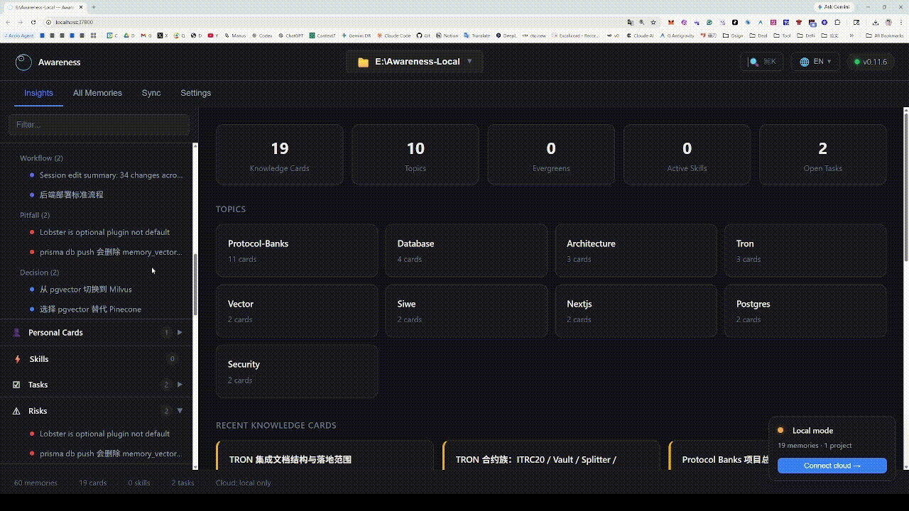

# Awareness Local

<p align="center">
  <strong>Languages:</strong> English | <a href="./README.zh-CN.md">简体中文</a>
</p>

<p align="center">
  <picture>
    <source media="(prefers-color-scheme: dark)" srcset="assets/branding/awareness-wordmark-dark.svg" />
    
  </picture>
</p>

<p align="center">
  <a href="https://arxiv.org/abs/2410.10813"></a>
  <a href="https://awareness.market/"></a>
  <a href="https://awareness.market/docs"></a>
  <a href="https://discord.com/invite/nMDrT538Qa"></a>
  <a href="LICENSE"></a>
</p>

<p align="center">
  
</p>

**Give your AI agent persistent memory. One command. No account. Works offline.**

Awareness Local is a local-first MCP memory server for AI coding agents. It gives Cursor, Claude Code, Copilot, Cline, and other MCP IDEs persistent memory, hybrid semantic + keyword retrieval, and reusable knowledge cards for long-running software projects.

It runs a lightweight daemon on your machine, stores memory as Markdown, indexes recall with SQLite FTS5 + embeddings, and keeps your AI workflow fast, explainable, and offline-ready.

```bash
npx @awareness.market/setup
```

That's it. Your AI agent now remembers everything across sessions.

---

## Why Awareness Local

AI coding agents lose context between sessions. Awareness Local provides cross-session memory recall so agents can continue work without re-explaining architecture, past decisions, pending tasks, and implementation constraints.

- Persistent memory for AI coding agents
- Local-first MCP server with offline support
- Hybrid retrieval (keyword + semantic)
- Knowledge card extraction for decisions, solutions, and risks

## Quick Start

```bash
npx @awareness.market/setup
```

Then open your IDE and start coding. Awareness tools become available for recall, record, and session initialization.

## Popular Use Cases

- Long-running codebase migrations across many sessions
- Team handoffs where AI should remember prior implementation context
- Personal coding workflows that need durable preferences and conventions
- Multi-agent setups that share decision history and task memory

## FAQ

### Does Awareness Local work offline?

Yes. Local mode works fully offline with memory stored on your machine.

### Where is data stored?

Memory is stored as Markdown in `.awareness/`, with a local SQLite index for retrieval.

### Do I need a cloud account?

No. Cloud sync is optional and can be enabled later.

### Which IDEs are supported?

Any MCP-compatible IDE, including Cursor, Claude Code, Copilot, Cline, Windsurf, and others. ChatGPT Desktop: Settings → MCP servers → Add server → Streamable HTTP → `http://127.0.0.1:37800/mcp` (local daemon only, no auth needed).

## Navigation

- [Benchmark: LongMemEval](#benchmark-longmemeval-iclr-2025)
- [Supported IDEs](#supported-ides-13)
- [How It Works](#how-it-works)
- [MCP Tools](#mcp-tools-available-in-your-ide)
- [Cloud Sync](#cloud-sync-optional)
- [SDK & Plugin Ecosystem](#sdk--plugin-ecosystem)

## Benchmark: LongMemEval (ICLR 2025)

Evaluated on **[LongMemEval](https://arxiv.org/abs/2410.10813)** — the industry standard benchmark for long-term conversational memory. 500 human-curated questions across 5 core capabilities.

```
╔══════════════════════════════════════════════════════════════╗
║                                                              ║
║   Awareness Memory — LongMemEval Benchmark Results           ║
║   ─────────────────────────────────────────────────           ║
║                                                              ║
║   Benchmark:  LongMemEval (ICLR 2025)                       ║
║   Dataset:    500 human-curated questions                    ║
║   Variant:    LongMemEval_S (~115k tokens per question)      ║
║                                                              ║
║   ┌─────────────────────────────────────────────────┐        ║
║   │                                                 │        ║
║   │   Recall@1    80.2%    (401 / 500)              │        ║
║   │   Recall@3    92.8%    (464 / 500)              │        ║
║   │   Recall@5    96.0%    (480 / 500)  ◀ PRIMARY   │        ║
║   │   Recall@10   98.6%    (493 / 500)              │        ║
║   │                                                 │        ║
║   └─────────────────────────────────────────────────┘        ║
║                                                              ║
║   Method:     Hybrid RRF (BM25 + vector, daemon pipeline)    ║
║   Embedding:  multilingual-e5-small (production model)       ║
║   LLM Calls:  0  (pure retrieval, no generation cost)        ║
║   Hardware:   Apple M1, 8GB RAM — 35 min total               ║
║                                                              ║
╚══════════════════════════════════════════════════════════════╝
```

```
┌─────────────────────────────────────────────────────────────┐
│          Long-Term Memory Retrieval — R@5 Leaderboard       │
│          LongMemEval (ICLR 2025, 500 questions)             │
├─────────────────────────────────┬───────────┬───────────────┤
│  System                         │  R@5      │  Note         │
├─────────────────────────────────┼───────────┼───────────────┤
│  MemPalace (ChromaDB raw)       │  96.6%    │  R@5 only *   │
│  ★ Awareness Memory (Hybrid)    │  96.0%    │  Hybrid RRF   │
│  OMEGA                          │  95.4%    │  QA Accuracy  │
│  Mastra (GPT-5-mini)            │  94.9%    │  QA Accuracy  │
│  Mastra (GPT-4o)                │  84.2%    │  QA Accuracy  │
│  Supermemory                    │  81.6%    │  QA Accuracy  │
│  Zep / Graphiti                 │  71.2%    │  QA Accuracy  │
│  GPT-4o (full context)          │  60.6%    │  QA Accuracy  │
├─────────────────────────────────┴───────────┴───────────────┤
│  * MemPalace 96.6% is Recall@5 only, not QA Accuracy.      │
│    Palace hierarchy was NOT used in the evaluation.         │
└─────────────────────────────────────────────────────────────┘
```

```
┌─────────────────────────────────────────────────────────────┐
│     Awareness Memory — R@5 by Question Type                 │
│                                                             │
│  knowledge-update        ███████████████████████████ 98.7%  │
│  multi-session           ███████████████████████████▊  99.2%│
│  single-session-asst     ███████████████████████████▌  98.2%│
│  temporal-reasoning      ██████████████████████████▏   93.2%│
│  single-session-user     ██████████████████████████    92.9%│
│  single-session-pref     █████████████████████████▎    90.0%│
│                                                             │
│  Overall                 ██████████████████████████▉   96.0%│
│                                                             │
│  ┌───────────────────────────────────────────────┐          │
│  │  Ablation Study                               │          │
│  │  ─────────────────────────────────────────    │          │
│  │  Vector-only:   92.6%  ▓▓▓▓▓▓▓▓▓▓▓▓▓░░░     │          │
│  │  BM25-only:     91.4%  ▓▓▓▓▓▓▓▓▓▓▓▓▓░░░     │          │
│  │  Hybrid RRF:    95.6%  ▓▓▓▓▓▓▓▓▓▓▓▓▓▓▓░  ★  │          │
│  │  (2026-04 harness run)                        │          │
│  │  Hybrid = +3% over any single method          │          │
│  └───────────────────────────────────────────────┘          │
│                                                             │
│  arxiv.org/abs/2410.10813          awareness.market         │
└─────────────────────────────────────────────────────────────┘
```

Zero LLM calls on retrieval (daemon path). [Reproducible benchmark scripts →](https://github.com/everest-an/Awareness-Market/tree/main/benchmarks/longmemeval)

---

## What It Does

**Before:** Every session starts from scratch. You re-explain the codebase, re-justify decisions, watch the agent redo work.

**After:** Your agent says *"I remember you were migrating from MySQL to PostgreSQL. Last session you completed the schema changes and had 2 TODOs remaining..."*

```
Session 1                          Session 2
┌─────────────────────────┐       ┌─────────────────────────┐
│ Agent: "What database?" │       │ Agent: "I remember we   │
│ You: "PostgreSQL..."    │       │ chose PostgreSQL for     │
│ Agent: "What framework?"│  →    │ JSON support. You had    │
│ You: "FastAPI..."       │       │ 2 TODOs left. Let me     │
│ (repeat every session)  │       │ continue from there."    │
└─────────────────────────┘       └─────────────────────────┘
```

---

## Supported IDEs (13+)

| IDE | Auto-detected | Plugin |
|-----|:---:|:---:|
| **Claude Code** | ✅ | [`awareness-memory`](https://github.com/everest-an/Awareness-SDK/tree/main/claudecode) |
| **Cursor** | ✅ | via MCP |
| **Windsurf** | ✅ | via MCP |
| **OpenClaw** | ✅ | [`@awareness.market/openclaw-memory`](https://www.npmjs.com/package/@awareness.market/openclaw-memory) |
| **Cline** | ✅ | via MCP |
| **GitHub Copilot** | ✅ | via MCP |
| **Codex CLI** | ✅ | via MCP |
| **Kiro** | ✅ | via MCP |
| **Trae** | ✅ | via MCP |
| **Zed** | ✅ | via MCP |
| **JetBrains (Junie)** | ✅ | via MCP |
| **Augment** | ✅ | via MCP |
| **AntiGravity (Jules)** | ✅ | via MCP |
| **ChatGPT Desktop** | ✅ | via MCP (Streamable HTTP, see FAQ) |

---

## How It Works

```
Your IDE / AI Agent
    │
    │  MCP Protocol (localhost:37800)
    ▼
┌────────────────────────────────────┐
│  Awareness Local Daemon            │
│                                    │
│  Markdown files    → Human-readable, git-friendly
│  SQLite FTS5       → Fast keyword search
│  Local embedding   → Semantic search (optional: npm i @huggingface/transformers)
│  Knowledge cards   → Auto-extracted decisions, solutions, risks
│  Web Dashboard     → http://localhost:37800/
│                                    │
│  Cloud sync (optional)             │
│  → One-click device-auth           │
│  → Bidirectional sync              │
│  → Semantic vector search          │
│  → Team collaboration              │
└────────────────────────────────────┘
```

### Your Data

All memories stored as **Markdown files** in `.awareness/` — human-readable, editable, git-friendly:

```
.awareness/
├── memories/
│   ├── 2026-03-22_decided-to-use-postgresql.md
│   ├── 2026-03-22_fixed-auth-bug.md
│   └── ...
├── knowledge/
│   ├── decisions/postgresql-over-mysql.md
│   └── solutions/auth-token-refresh.md
├── tasks/
│   └── open/implement-rate-limiting.md
└── index.db  (search index, auto-rebuilt)
```

---

## Features

### MCP Tools (available in your IDE)

| Tool | What it does |
|------|-------------|
| `awareness_init` | Load session context — recent knowledge, tasks, rules |
| `awareness_recall` | Search memories — progressive disclosure (summary → full) |
| `awareness_record` | Save decisions, code changes, insights — with knowledge extraction |
| `awareness_lookup` | Fast lookup — tasks, knowledge cards, session history, risks |
| `awareness_get_agent_prompt` | Get agent-specific prompts for multi-agent setups |

### Progressive Disclosure (Smart Token Usage)

Instead of dumping everything into context, Awareness uses a two-phase recall:

```
Phase 1: awareness_recall(query, detail="summary")
  → Lightweight index (~80 tokens each): title + summary + score
  → Agent reviews and picks what's relevant

Phase 2: awareness_recall(detail="full", ids=[...])
  → Complete content for selected items only
  → No truncation, no wasted tokens
```

### Web Dashboard

Visit `http://localhost:37800/` to browse memories, knowledge cards, tasks, and manage cloud sync.

### Cloud Sync (Optional)

Connect to [Awareness Cloud](https://awareness.market) for:
- Semantic vector search (100+ languages)
- Cross-device real-time sync
- Team collaboration
- Memory marketplace

```bash
npx @awareness.market/setup --cloud
# Or click "Connect to Cloud" in the dashboard
```

---

## SDK & Plugin Ecosystem

Awareness Local is part of the Awareness ecosystem:

| Package | For | Install |
|---------|-----|---------|
| **[Awareness Local](https://github.com/everest-an/Awareness-Market)** | Local daemon + MCP server | `npx @awareness.market/setup` |
| **[Python SDK](https://pypi.org/project/awareness-memory-cloud/)** | `wrap_openai()` / `wrap_anthropic()` interceptors | `pip install awareness-memory-cloud` |
| **[TypeScript SDK](https://www.npmjs.com/package/@awareness-sdk/memory-cloud)** | `wrapOpenAI()` / `wrapAnthropic()` interceptors | `npm i @awareness-sdk/memory-cloud` |
| **[OpenClaw Plugin](https://www.npmjs.com/package/@awareness.market/openclaw-memory)** | Auto-recall + auto-capture | `openclaw plugins install @awareness.market/openclaw-memory` |
| **[Claude Code Plugin](https://github.com/everest-an/Awareness-SDK/tree/main/claudecode)** | Skills + hooks | `/plugin marketplace add everest-an/Awareness-SDK` → `/plugin install awareness-memory@awareness` |
| **[Setup CLI](https://www.npmjs.com/package/@awareness.market/setup)** | One-command setup for 13+ IDEs | `npx @awareness.market/setup` |

Full SDK docs: [awareness.market/docs](https://awareness.market/docs)

---

## Requirements

- Node.js 18+
- Any MCP-compatible IDE

No Python, no Docker, no cloud account needed.

## ⭐ Support the project

If Awareness Local saves you from re-explaining your codebase to your AI agent, give it a ⭐ — it helps more developers discover the project and pushes it toward GitHub Trending.

[](https://star-history.com/#everest-an/Awareness-Market)

## License

MIT

---

### Tags & Integration
**IDE Support:** [Cursor](https://cursor.com), [Windsurf](https://codeium.com/windsurf), [Trae](https://www.trae.sh), [Zed](https://zed.dev), VS Code, JetBrains.
**Compatible with:** OpenClaw, AutoGPT, LangChain, MetaGPT.
**Key Technology:** OMP (Open Memory Protocol), LatentMAS, Shared Thought Space, One-click Deployment.
**Focus:** Solving AI "Lobster Memory" (Long-term memory loss), Automating complex workflows, Simplifying Agent setup.
