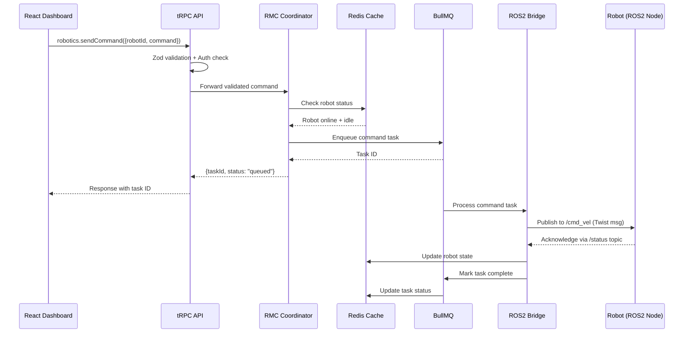
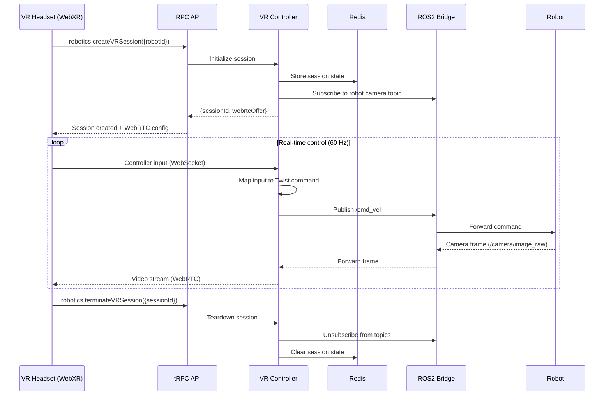

# RMC Architecture

## System Architecture Overview

The Robotics Middleware Controller is structured as a layered system where each tier has a single responsibility. Requests flow from clients through the API layer into the RMC core, which coordinates with infrastructure services and communicates with robots through the ROS2 bridge.

```
┌─────────────────────────────────────────────────────────────────────────┐
│                          CLIENT LAYER                                   │
│                                                                         │
│   ┌───────────────────────┐       ┌───────────────────────┐             │
│   │   React Dashboard     │       │    VR Panel (WebXR)   │             │
│   │                       │       │                       │             │
│   │  - Fleet overview     │       │  - Teleoperation      │             │
│   │  - Task management    │       │  - Camera feeds       │             │
│   │  - Health monitoring  │       │  - Gesture control    │             │
│   │  - Metrics display    │       │  - Robot switching    │             │
│   └───────────┬───────────┘       └───────────┬───────────┘             │
│               │                               │                         │
│               │    tRPC (type-safe calls)      │  WebRTC (video)        │
│               │    WebSocket (real-time)       │  WebSocket (commands)  │
└───────────────┼───────────────────────────────┼─────────────────────────┘
                │                               │
                ▼                               ▼
┌─────────────────────────────────────────────────────────────────────────┐
│                          tRPC API LAYER                                 │
│                                                                         │
│   ┌─────────────────────────────────────────────────────────────────┐   │
│   │                     tRPC Router                                 │   │
│   │                                                                 │   │
│   │  robotics.health          robotics.authenticateRobot            │   │
│   │  robotics.listOnlineRobots    robotics.createTask               │   │
│   │  robotics.createVRSession     robotics.sendCommand              │   │
│   │  robotics.emergencyStop       robotics.recordObservation        │   │
│   │  ... (20+ endpoints)                                            │   │
│   └─────────────────────────────────┬───────────────────────────────┘   │
│                                     │                                   │
│   ┌──────────────┐  ┌──────────────┐│  ┌──────────────┐                │
│   │  Zod Schema  │  │  Auth Guard  ││  │  Rate Limiter│                │
│   │  Validation  │  │  (MCP Token) ││  │  (per-robot) │                │
│   └──────────────┘  └──────────────┘│  └──────────────┘                │
└─────────────────────────────────────┼──────────────────────────────────┘
                                      │
                                      ▼
┌─────────────────────────────────────────────────────────────────────────┐
│                          RMC CORE LAYER                                 │
│                                                                         │
│   ┌───────────────────┐  ┌───────────────────┐  ┌──────────────────┐   │
│   │    Coordinator     │  │   VR Controller   │  │   ROS2 Bridge    │   │
│   │                    │  │                   │  │                  │   │
│   │  - Robot registry  │  │  - Session mgmt   │  │  - Topic sub/pub │   │
│   │  - Task assignment │  │  - Input mapping  │  │  - Msg translate │   │
│   │  - Fleet status    │  │  - Gesture recog  │  │  - Node lifecycle│   │
│   │  - Conflict resol  │  │  - Camera routing │  │  - Custom msgs   │   │
│   └────────┬──────────┘  └────────┬──────────┘  └────────┬─────────┘   │
│            │                      │                       │             │
│            └──────────────────────┼───────────────────────┘             │
│                                   │                                     │
│                          ┌────────▼────────┐                           │
│                          │  State Manager  │                           │
│                          │                 │                           │
│                          │  Unified state  │                           │
│                          │  access layer   │                           │
│                          └────────┬────────┘                           │
└───────────────────────────────────┼────────────────────────────────────┘
                                    │
                                    ▼
┌─────────────────────────────────────────────────────────────────────────┐
│                      INFRASTRUCTURE LAYER                               │
│                                                                         │
│   ┌──────────────┐  ┌──────────────┐  ┌──────────────┐  ┌───────────┐ │
│   │    Redis      │  │   BullMQ     │  │  PostgreSQL  │  │Prometheus │ │
│   │              │  │              │  │              │  │           │ │
│   │  State cache │  │  Task queues │  │  Persistent  │  │  Metrics  │ │
│   │  Session     │  │  Priorities  │  │  storage     │  │  export   │ │
│   │  Pub/Sub     │  │  Retries     │  │  History     │  │  Alerting │ │
│   │  125x boost  │  │  DLQ         │  │  Audit log   │  │  Grafana  │ │
│   └──────────────┘  └──────────────┘  └──────────────┘  └───────────┘ │
│                                                                         │
└─────────────────────────────────────────────────────────────────────────┘
                                    │
                                    ▼
┌─────────────────────────────────────────────────────────────────────────┐
│                        ROBOT LAYER                                      │
│                                                                         │
│   ┌──────────────┐  ┌──────────────┐  ┌──────────────────────────┐     │
│   │  Unitree Go2 │  │  Spot (BD)   │  │  Custom ROS2 Robots      │     │
│   │  (Adapter)   │  │  (Adapter)   │  │  (Native ROS2 nodes)     │     │
│   └──────────────┘  └──────────────┘  └──────────────────────────┘     │
│                                                                         │
└─────────────────────────────────────────────────────────────────────────┘
```

---

## Layer Descriptions

### Client Layer

The client layer consists of two primary interfaces that connect to the RMC through different channels.

**React Dashboard** -- A web-based control panel for fleet operators. It uses tRPC client bindings for type-safe API calls and WebSocket subscriptions for real-time state updates. The dashboard provides fleet overview, task management, health monitoring, and metrics visualization.

**VR Panel (WebXR)** -- An immersive teleoperation interface built on the WebXR API. It connects through both WebSocket (for command transmission and state updates) and WebRTC (for low-latency video streaming from robot cameras). The VR panel supports controller input mapping, gesture recognition, and seamless switching between robots in a fleet.

Both clients share the same tRPC API contracts, ensuring type consistency from the browser to the server.

### tRPC API Layer

The API layer is the single entry point for all external communication. It provides:

- **tRPC Router**: 20+ procedure definitions organized by domain (health, auth, robots, tasks, VR, memory, control). Each procedure is a strongly typed function with Zod schema validation on inputs and outputs.
- **Zod Schema Validation**: Every request is validated against a Zod schema before reaching the core layer. Invalid requests are rejected with structured error responses containing field-level details.
- **Auth Guard (MCP Token)**: Robot authentication uses MCP (Model Context Protocol) tokens. Each robot receives a unique token during registration that must be included in all subsequent requests. Human operators authenticate through the Awareness Network's standard auth flow.
- **Rate Limiter**: Per-robot and per-operator rate limiting prevents any single entity from overwhelming the system. Limits are configurable and tracked in Redis for distributed enforcement.

### RMC Core Layer

The core layer contains three primary subsystems that share state through the State Manager.

**Coordinator** -- The central orchestration engine for multi-robot operations. It maintains the robot registry (which robots are online, their capabilities, current status), handles task assignment (matching tasks to capable robots, optimizing for locality and load), tracks fleet-wide status, and resolves conflicts when multiple tasks compete for the same robot.

**VR Controller** -- Manages the lifecycle of VR teleoperation sessions. It handles session creation and teardown, maps controller inputs to robot commands (right controller for movement, left for actions), processes gesture recognition, and routes camera feeds from the controlled robot to the operator's headset via WebRTC.

**ROS2 Bridge** -- The bidirectional communication bridge between the web-native RMC and the ROS2 ecosystem. It subscribes to and publishes on ROS2 topics, translates between JSON (used internally) and ROS2 message types (Twist, JointState, Image, LaserScan), manages ROS2 node lifecycle, and supports custom message definitions.

**State Manager** -- A unified abstraction over Redis (for fast reads) and PostgreSQL (for persistence). All three subsystems read and write state through the State Manager, which handles cache population, invalidation, and write-through to the database.

### Infrastructure Layer

**Redis** -- Primary state cache delivering 125x read performance over direct PostgreSQL queries. Also provides Pub/Sub channels for real-time state change notifications between subsystems and across distributed RMC instances.

**BullMQ** -- Task queue system backed by Redis. Handles asynchronous operations that should not block the API response cycle: multi-step movement sequences, sensor data aggregation, batch fleet commands. Supports priority levels, configurable retry strategies, and dead letter queues.

**PostgreSQL** -- Persistent storage for all data that must survive restarts: robot registration records, task history, session logs, observation memory, and audit trails.

**Prometheus** -- Metrics collection endpoint. Every subsystem exports counters, histograms, and gauges. Standard scrape endpoint at `/metrics` for integration with Grafana or any Prometheus-compatible monitoring system.

### Robot Layer

Physical and simulated robots connect to the RMC through ROS2. Robots with native ROS2 support connect directly. Robots with proprietary SDKs (Unitree Go2, Boston Dynamics Spot) use adapter nodes that translate between the vendor SDK and standard ROS2 interfaces.

---

## Data Flow

### Command Execution Flow



### VR Teleoperation Flow



---

## Design Decisions

### Why tRPC Over REST or GraphQL

tRPC provides end-to-end type safety from the React/VR client to the server with zero code generation. Since both the client and server are TypeScript, tRPC eliminates an entire class of integration bugs. The procedure-based API model also maps cleanly to robotic operations (commands, queries, subscriptions) without the overhead of GraphQL's query language or REST's resource modeling.

### Why Redis + PostgreSQL (Not Just One)

Robotics workloads have a bimodal data access pattern. **Hot path** operations (checking robot status, reading session state, polling task progress) happen at high frequency and require sub-millisecond latency. **Cold path** operations (querying task history, auditing sessions, generating reports) happen infrequently but require durability and complex querying. Redis handles the hot path; PostgreSQL handles the cold path. The State Manager abstracts this split from the core logic.

### Why BullMQ Over Direct Execution

Robot commands often involve multi-step sequences (move to waypoint A, rotate, move to B, pick up object). Executing these synchronously in the API request cycle would block the server and create timeout risks. BullMQ allows us to enqueue the full sequence, return a task ID immediately, and process steps asynchronously. It also provides built-in retry logic for transient failures (network drops, robot temporarily unresponsive) and dead letter queues for permanent failures.

### Why ROS2 as the Robot Communication Layer

ROS2 is the de facto standard for robot communication. By building on ROS2, the RMC inherits support for hundreds of robot platforms, sensor types, and algorithms without custom integration work. The DDS transport layer provides quality-of-service guarantees (reliable delivery, deadline enforcement) that are critical for real-time robot control. Robots that do not natively support ROS2 are integrated through thin adapter nodes.

### Why WebXR for VR Control

WebXR runs in the browser, eliminating the need for native VR application installation and updates. Operators can start a teleoperation session by navigating to a URL and putting on their headset. WebXR also provides a hardware abstraction layer that supports Meta Quest, HTC Vive, Valve Index, and other headsets through a single codebase.

---

## Deployment Topology

```
┌─────────────────────────────────────────────────────┐
│                Production Deployment                 │
│                                                     │
│   ┌──────────────┐    ┌──────────────┐              │
│   │  RMC Node 1  │    │  RMC Node 2  │   (scalable) │
│   │  (API + Core)│    │  (API + Core)│              │
│   └──────┬───────┘    └──────┬───────┘              │
│          │                   │                       │
│          └─────────┬─────────┘                       │
│                    │                                 │
│          ┌─────────▼─────────┐                       │
│          │   Load Balancer   │                       │
│          │   (Nginx/Traefik) │                       │
│          └─────────┬─────────┘                       │
│                    │                                 │
│   ┌────────────────┼────────────────┐                │
│   │                │                │                │
│   ▼                ▼                ▼                │
│  Redis          PostgreSQL      Prometheus           │
│  (Sentinel)     (Primary +      (+ Grafana)          │
│                  Replica)                            │
│                                                     │
│          ┌─────────────────────┐                     │
│          │   ROS2 Bridge Node  │                     │
│          │   (dedicated host)  │                     │
│          └─────────┬───────────┘                     │
│                    │  DDS multicast                  │
│          ┌─────────▼───────────┐                     │
│          │   Robot Network     │                     │
│          │   (Wi-Fi / Ethernet)│                     │
│          └─────────────────────┘                     │
└─────────────────────────────────────────────────────┘
```

The API and core layers can be scaled horizontally behind a load balancer. Redis Sentinel provides high availability for the cache layer. PostgreSQL uses primary-replica replication for read scaling and failover. The ROS2 Bridge runs on a dedicated host with direct network access to the robots (DDS multicast requires Layer 2 adjacency or a DDS router for cross-network communication).
