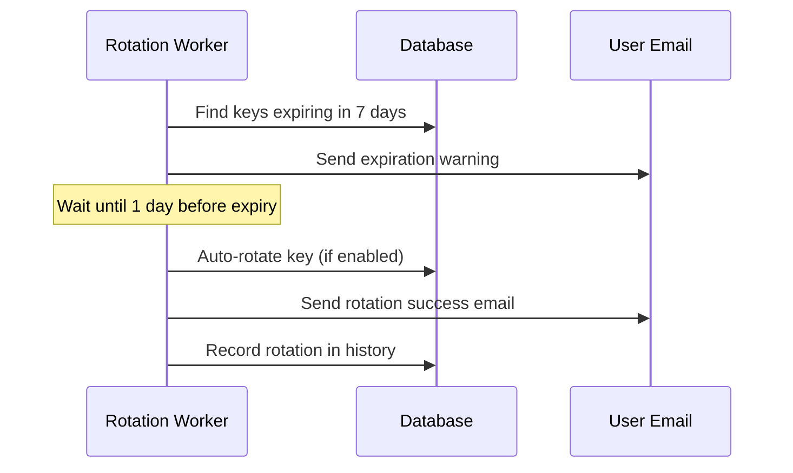

# P2 Security: API Key Auto-Rotation

## Overview

Automated API key lifecycle management to reduce the risk of compromised keys and enforce key hygiene practices.

## Features

### 1. **Auto-Rotation**
- Enable/disable auto-rotation per API key
- Configurable rotation intervals (default: 90 days)
- Automatic key rotation before expiration
- New keys inherit permissions and settings from old keys

### 2. **Expiration Warnings**
- Email notifications at 7, 3, and 1 day before expiration
- Prevents double-notification (12-hour cooldown)
- User-specific notifications grouped by key

### 3. **Rotation History**
- Track all rotations (manual, automatic, forced)
- Audit trail with timestamps and reasons
- Links old keys to new keys via `rotatedFromId`

### 4. **Expired Key Handling**
- Automatic revocation of expired keys
- Last-chance auto-rotation attempt
- Force-revoke if auto-rotation fails

## Database Schema

### ApiKey Model (Extended)
```prisma
model ApiKey {
  // Existing fields...
  autoRotationEnabled   Boolean   @default(false)
  rotationIntervalDays  Int       @default(90)
  rotatedFromId         Int?      // Link to previous key
  notificationSentAt    DateTime? // Last warning notification
  rotationHistory       ApiKeyRotationHistory[]
}
```

### ApiKeyRotationHistory Model (New)
```prisma
model ApiKeyRotationHistory {
  id              Int      @id @default(autoincrement())
  apiKeyId        Int
  oldKeyPrefix    String
  newKeyPrefix    String
  rotationType    String   // 'manual', 'automatic', 'forced'
  rotatedBy       Int?     // User ID for manual rotations
  rotationReason  String?
  createdAt       DateTime @default(now())
}
```

## API Endpoints (tRPC)

### Create API Key with Auto-Rotation
```typescript
const result = await trpc.apiKeys.create.mutate({
  name: 'My Production Key',
  permissions: ['*'],
  autoRotationEnabled: true,
  rotationIntervalDays: 90
});
// Returns: { id, key, keyPrefix, autoRotationEnabled }
```

### Manual Rotation
```typescript
const result = await trpc.apiKeys.rotate.mutate({
  keyId: 123,
  reason: 'Key potentially compromised'
});
// Returns: { success, newKey, newKeyPrefix, newKeyId }
```

### Enable Auto-Rotation (Existing Key)
```typescript
await trpc.apiKeys.enableAutoRotation.mutate({
  keyId: 123,
  rotationIntervalDays: 60
});
```

### Disable Auto-Rotation
```typescript
await trpc.apiKeys.disableAutoRotation.mutate({
  keyId: 123
});
```

### View Rotation History
```typescript
const history = await trpc.apiKeys.getRotationHistory.query({
  keyId: 123
});
// Returns: [{ id, oldKeyPrefix, newKeyPrefix, rotationType, rotationReason, createdAt }]
```

## Worker Jobs

### API Key Rotation Worker
**File**: `server/workers/api-key-rotation-worker.ts`

**Schedule**: Every 6 hours (configurable via `KEY_ROTATION_CHECK_INTERVAL`)

**Tasks**:
1. Check for keys expiring in 7/3/1 days
2. Send expiration warning emails
3. Auto-rotate keys with auto-rotation enabled
4. Force-revoke already expired keys

**Environment Variables**:
```env
# Enable auto-rotation (default: true)
ENABLE_AUTO_KEY_ROTATION=true

# Check interval in hours (default: 6)
KEY_ROTATION_CHECK_INTERVAL=6

# Notification email (optional)
KEY_ROTATION_NOTIFICATION_EMAIL=admin@awareness.market
```

## Usage Examples

### Scenario 1: Create Key with Auto-Rotation
```typescript
// User creates a production API key that rotates every 90 days
const key = await trpc.apiKeys.create.mutate({
  name: 'Production API Key',
  permissions: ['*'],
  autoRotationEnabled: true,
  rotationIntervalDays: 90
});

// Store the key securely (only shown once)
console.log('Your API key:', key.key);
```

### Scenario 2: Rotate Compromised Key
```typescript
// User suspects key compromise and manually rotates
const result = await trpc.apiKeys.rotate.mutate({
  keyId: 456,
  reason: 'Key found in public GitHub repo'
});

// Update applications with new key
updateApplications(result.newKey);
```

### Scenario 3: Auto-Rotation Workflow


## Security Benefits

### 1. **Reduced Exposure Window**
- Keys expire automatically after rotation interval
- Limits damage from compromised keys
- Enforces security hygiene

### 2. **Audit Trail**
- Complete rotation history
- Tracks who rotated (manual) vs automatic
- Compliance-ready audit logs

### 3. **Zero-Downtime Rotation**
- Old key remains active until user updates apps
- Grace period for gradual migration
- No service interruption

### 4. **Proactive Warnings**
- 7-day, 3-day, 1-day notifications
- Prevents unexpected key expiration
- Gives users time to plan rotation

## Migration Guide

### Existing Users
```sql
-- Add auto-rotation fields to existing ApiKey table
ALTER TABLE api_keys
  ADD COLUMN auto_rotation_enabled BOOLEAN DEFAULT false,
  ADD COLUMN rotation_interval_days INT DEFAULT 90,
  ADD COLUMN rotated_from_id INT,
  ADD COLUMN notification_sent_at TIMESTAMP;

-- Create rotation history table
CREATE TABLE api_key_rotation_history (
  id SERIAL PRIMARY KEY,
  api_key_id INT NOT NULL,
  old_key_prefix VARCHAR(16) NOT NULL,
  new_key_prefix VARCHAR(16) NOT NULL,
  rotation_type VARCHAR(20) NOT NULL,
  rotated_by INT,
  rotation_reason VARCHAR(255),
  created_at TIMESTAMP DEFAULT NOW(),
  FOREIGN KEY (api_key_id) REFERENCES api_keys(id) ON DELETE CASCADE
);

-- Add index for performance
CREATE INDEX idx_api_key_expiration ON api_keys(expires_at);
CREATE INDEX idx_rotation_history_key ON api_key_rotation_history(api_key_id);
```

## Best Practices

### For Users
1. **Enable auto-rotation** for production keys
2. **Use shorter intervals** (30-60 days) for high-security apps
3. **Monitor rotation history** regularly
4. **Test rotation** in development first
5. **Update applications promptly** after rotation

### For Developers
1. **Store keys in environment variables**, not code
2. **Implement graceful key refresh** in applications
3. **Log API errors** to detect expired keys quickly
4. **Use key prefixes** for identification
5. **Subscribe to notification emails**

## Monitoring & Alerts

### Key Metrics
- Keys expiring in next 7 days
- Auto-rotation success rate
- Failed rotation attempts
- Notification delivery status

### Alerts
- Send Slack/email when rotation fails
- Alert on expired keys still active
- Notify admin of high failure rate

## Troubleshooting

### Q: Auto-rotation failed, what happened?
**A**: Check rotation history for error reason. Common causes:
- Database connection issue
- Permission mismatch
- Invalid expiration date

### Q: Didn't receive expiration warning?
**A**: Check `notification_sent_at` field. Warnings are sent once per 12 hours to avoid spam.

### Q: Old key still works after rotation?
**A**: Old keys are revoked (`isActive = false`) immediately after rotation. Verify key status in database.

### Q: How to recover from failed rotation?
**A**: Manually rotate the key using `trpc.apiKeys.rotate` mutation.

## Related Documentation
- [Input Validation Enhancement](./P1-INPUT-VALIDATION.md)
- [Rate Limiting](./P1-RATE-LIMITING.md)
- [Security Enhancements P1](../SECURITY_ENHANCEMENTS_P1.md)
