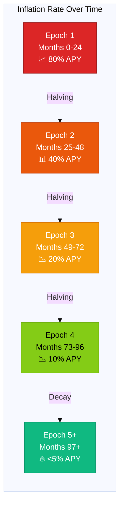
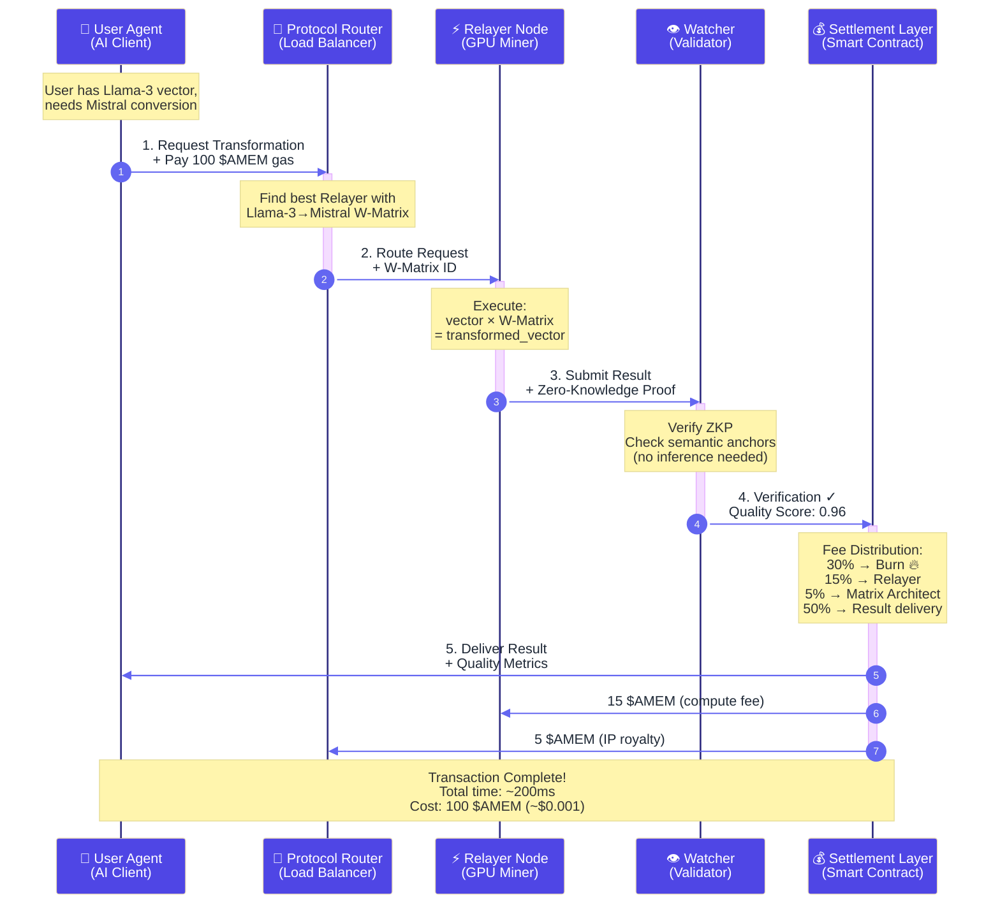
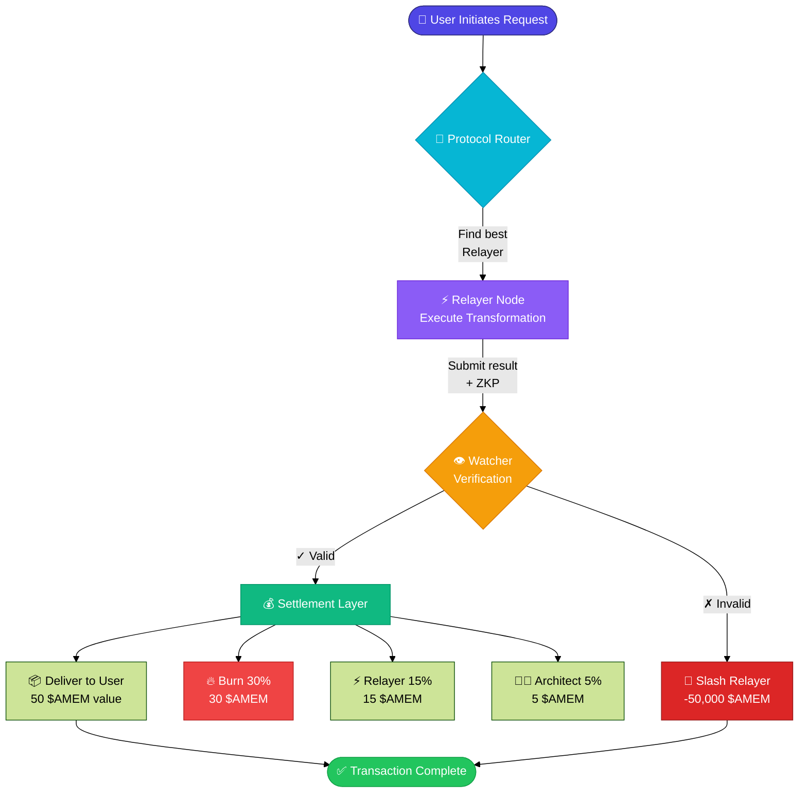
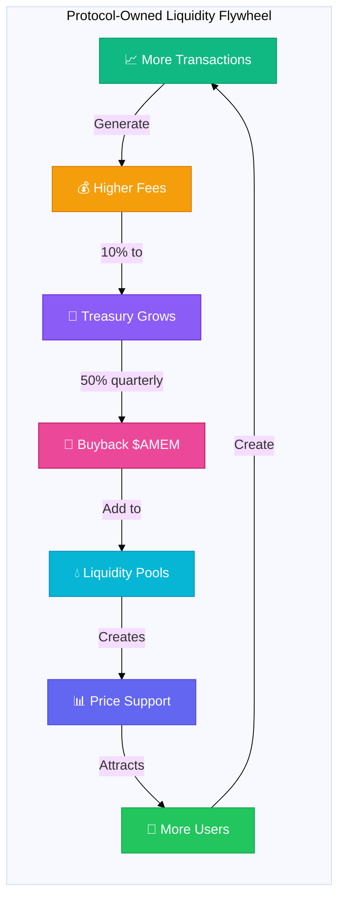
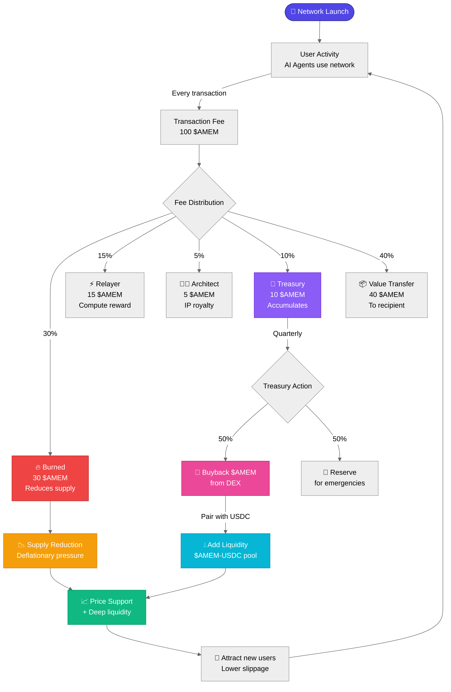
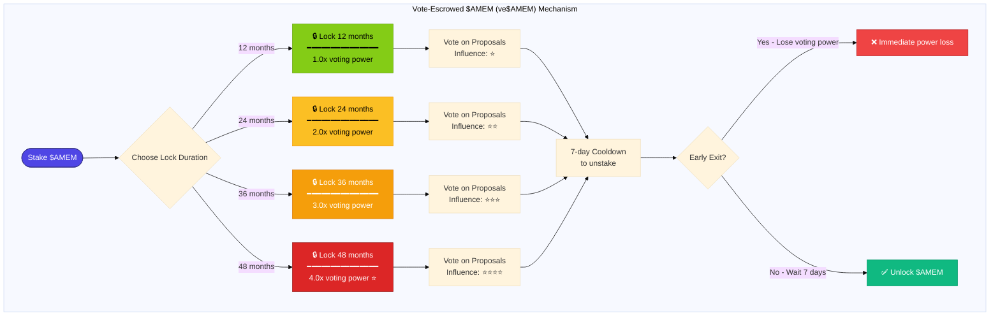
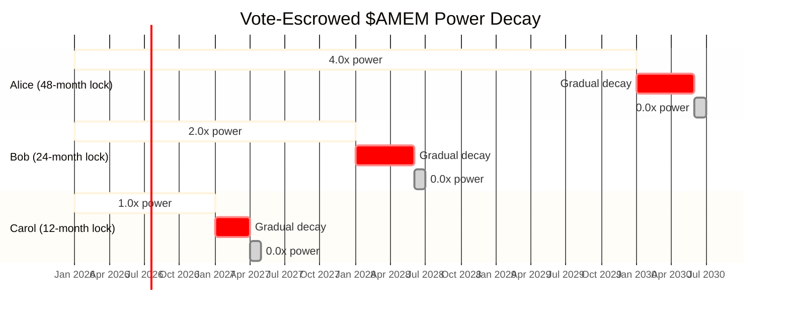
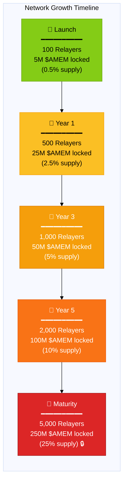

# 代币经济学可视化图表

本文档包含白皮书Section 10.7-10.9的所有Mermaid图表代码。

---

## 图表1: 排放曲线 (Emission Curve)

### 流通供应曲线

```mermaid
%%{init: {'theme':'base', 'themeVariables': { 'primaryColor':'#4F46E5','primaryTextColor':'#fff','primaryBorderColor':'#312E81','lineColor':'#6366F1','secondaryColor':'#10B981','tertiaryColor':'#F59E0B'}}}%%
graph TD
    subgraph "Token Emission Timeline (10 Years)"
        Y0["Year 0<br/>100M tokens<br/>(10% circulating)"]
        Y2["Year 2<br/>280M tokens<br/>(28% circulating)"]
        Y4["Year 4<br/>520M tokens<br/>(52% circulating)"]
        Y6["Year 6<br/>720M tokens<br/>(72% circulating)"]
        Y8["Year 8<br/>860M tokens<br/>(86% circulating)"]
        Y10["Year 10<br/>950M tokens<br/>(95% circulating)"]

        Y0 -->|High emission| Y2
        Y2 -->|Halving #1| Y4
        Y4 -->|Halving #2| Y6
        Y6 -->|Halving #3| Y8
        Y8 -->|Tail emission| Y10

        style Y0 fill:#EF4444,stroke:#B91C1C,color:#fff
        style Y2 fill:#F59E0B,stroke:#D97706,color:#fff
        style Y4 fill:#FBBF24,stroke:#F59E0B,color:#000
        style Y6 fill:#84CC16,stroke:#65A30D,color:#000
        style Y8 fill:#10B981,stroke:#059669,color:#fff
        style Y10 fill:#06B6D4,stroke:#0891B2,color:#fff
    end
```



### 通胀率递减图



---

## 图表2: 交易生命周期 (Transaction Lifecycle)

### 完整序列图



### 简化流程图



---

## 图表3: 参与角色矩阵 (Participation Matrix)

### 4个角色关系图

```mermaid
%%{init: {'theme':'base'}}%%
graph TB
    subgraph "Awareness Network Roles"
        Architect[👨‍💻 Matrix Architect<br/>━━━━━━━━━━━━━━━<br/>Entry: Intellectual Capital<br/>Action: Train W-Matrix<br/>Revenue: Royalty Fees 💎]

        Relayer[⚡ Relayer Node<br/>━━━━━━━━━━━━━━━<br/>Entry: 24GB GPU + 50K $AMEM<br/>Action: Execute Transformations<br/>Revenue: Priority Fees + Block Rewards 💰]

        Watcher[👁️ Watcher<br/>━━━━━━━━━━━━━━━<br/>Entry: 5K $AMEM Stake<br/>Action: Verify with ZKP<br/>Revenue: Bounty Rewards 🎯]

        User[🤖 Agent Operator<br/>━━━━━━━━━━━━━━━<br/>Entry: $AMEM Balance<br/>Action: Use Network<br/>Revenue: N/A (Consumer) 🛍️]

        Architect -->|Uploads W-Matrix| Market[(🏪 Matrix Marketplace)]
        Market -->|Royalty 5%| Architect

        Relayer -->|Stakes 50K $AMEM| Network{🌐 Awareness Network}
        Network -->|Priority Fees 15%| Relayer

        Watcher -->|Stakes 5K $AMEM| Network
        Network -->|Bounties 50% slashed| Watcher

        User -->|Pays Gas| Network
        Network -->|Result| User

        Market -.W-Matrix.-> Relayer
        Network -->|30% Burn 🔥| Burn[💀 Deflationary]
    end

    style Architect fill:#8B5CF6,stroke:#6D28D9,color:#fff
    style Relayer fill:#06B6D4,stroke:#0891B2,color:#fff
    style Watcher fill:#F59E0B,stroke:#D97706,color:#fff
    style User fill:#10B981,stroke:#059669,color:#fff
    style Market fill:#EC4899,stroke:#BE185D,color:#fff
    style Network fill:#4F46E5,stroke:#312E81,color:#fff
    style Burn fill:#EF4444,stroke:#B91C1C,color:#fff
```

---

## 图表4: 协议自有流动性飞轮 (POL Flywheel)

### 正反馈循环



### 飞轮详细机制



---

## 图表5: 治理护盾 (Governance Shield)

### 投票权曲线



### 投票权衰减机制



---

## 图表6: 质押锁定增长 (Staking Lock-up Growth)

### 网络成长与供应锁定



---

## 使用说明

### 在GitHub/GitLab中查看
这些Mermaid图表可以直接在GitHub、GitLab、Notion等支持Mermaid的Markdown渲染器中查看。

### 在本地预览
使用以下工具预览Mermaid图表：
1. **VSCode**: 安装 "Markdown Preview Mermaid Support" 插件
2. **在线编辑器**: https://mermaid.live/
3. **命令行**: `npm install -g @mermaid-js/mermaid-cli`

### 导出为图片
```bash
# 安装mermaid-cli
npm install -g @mermaid-js/mermaid-cli

# 导出为PNG
mmdc -i TOKENOMICS_CHARTS.md -o emission-curve.png

# 导出为SVG（矢量图，推荐）
mmdc -i TOKENOMICS_CHARTS.md -o emission-curve.svg
```

### 嵌入到白皮书
将相应的Mermaid代码块直接复制到 `WHITEPAPER.md` 的对应章节，替换ASCII艺术。

---

**文档版本**: 1.0.0
**创建日期**: 2026-01-29
**作者**: Claude Sonnet 4.5
**更新日志**: 初始创建，包含6个主要图表
