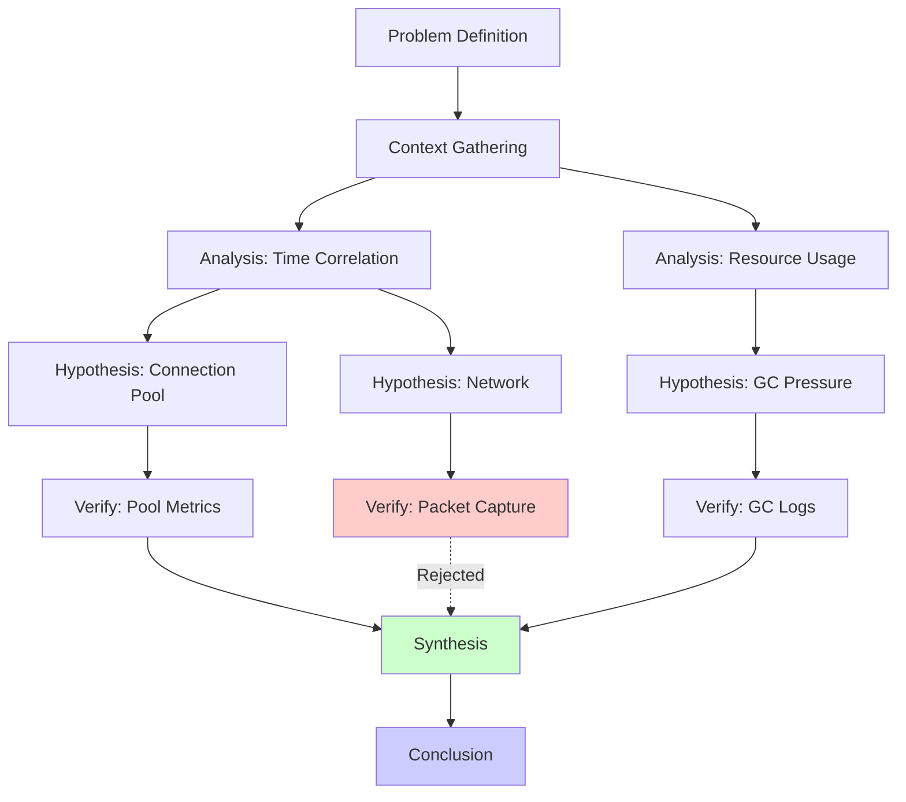

# Chain Structure

## Overview

Every Reasoning Chain is a **directed acyclic graph (DAG)** composed of typed nodes, where each node represents a discrete thought step in the model's problem-solving process. This page provides a detailed technical description of chain structure, node types, metadata, and branching mechanics.

---

## Anatomy of a Reasoning Chain

A Reasoning Chain consists of three structural layers:

```
┌─────────────────────────────────────────────┐
│  Layer 1: Chain Metadata                     │
│  (ID, source model, problem statement,       │
│   creation timestamp, quality metrics)        │
├─────────────────────────────────────────────┤
│  Layer 2: Node Graph                         │
│  (Directed acyclic graph of thought nodes,   │
│   with typed edges representing logical       │
│   dependencies and reasoning flow)            │
├─────────────────────────────────────────────┤
│  Layer 3: Node Content                       │
│  (Per-node reasoning text, confidence         │
│   scores, evidence references, and            │
│   intermediate results)                       │
└─────────────────────────────────────────────┘
```

### Chain-Level Schema

```json
{
  "chain_id": "awrc_a1b2c3d4",
  "version": "1.0",
  "source_model": "claude-3.5-sonnet",
  "source_model_version": "20240620",
  "problem_statement": "Determine the root cause of intermittent latency spikes...",
  "domain": "software_engineering",
  "tags": ["debugging", "performance", "distributed-systems"],
  "created_at": "2025-03-15T14:22:00Z",
  "total_nodes": 24,
  "total_branches": 3,
  "max_depth": 12,
  "quality_score": 0.94,
  "retention_rate": 0.98,
  "nodes": [ ... ],
  "edges": [ ... ]
}
```

---

## Chain Nodes (Thought Steps)

Each node in the reasoning chain represents a single thought step. Nodes are the fundamental building blocks of the chain.

### Node Schema

```json
{
  "node_id": "node_001",
  "type": "analysis",
  "title": "Identify latency correlation with time-of-day",
  "content": "Examining the latency data reveals a strong correlation with peak traffic hours (14:00-18:00 UTC). The P99 latency increases from 45ms to 320ms during these windows. This suggests the issue is load-dependent rather than caused by a periodic background process.",
  "confidence": 0.87,
  "evidence": [
    {
      "type": "data_reference",
      "description": "Latency time-series from Datadog dashboard",
      "weight": 0.9
    }
  ],
  "inputs": ["node_000"],
  "outputs": ["node_002", "node_003"],
  "metadata": {
    "model": "claude-3.5-sonnet",
    "timestamp": "2025-03-15T14:22:15Z",
    "token_count": 156,
    "layer_activations_summary": "high_attention_layers: [24, 25, 48, 49]",
    "reasoning_type": "deductive"
  },
  "intermediate_results": {
    "correlation_coefficient": 0.89,
    "peak_hours": ["14:00", "15:00", "16:00", "17:00", "18:00"],
    "baseline_p99": "45ms",
    "peak_p99": "320ms"
  }
}
```

### Node Fields

| Field | Type | Description |
|---|---|---|
| `node_id` | string | Unique identifier within the chain |
| `type` | enum | Node type (see Node Types below) |
| `title` | string | Brief summary of the thought step |
| `content` | string | Full reasoning text for this step |
| `confidence` | float (0--1) | Model's confidence in this step's reasoning |
| `evidence` | array | Supporting evidence or data references |
| `inputs` | array[string] | IDs of predecessor nodes (dependencies) |
| `outputs` | array[string] | IDs of successor nodes |
| `metadata` | object | Additional context (model, timestamp, etc.) |
| `intermediate_results` | object | Computed values or conclusions from this step |

---

## Node Types

Each node is classified into one of several types that describe its role in the reasoning process.

### Primary Node Types

| Type | Symbol | Description | Typical Position |
|---|---|---|---|
| `problem_definition` | `[P]` | States the problem to be solved | Start |
| `analysis` | `[A]` | Examines data, context, or constraints | Early/Mid |
| `hypothesis` | `[H]` | Proposes a possible explanation or approach | Mid |
| `verification` | `[V]` | Tests a hypothesis against evidence | Mid/Late |
| `deduction` | `[D]` | Derives a logical consequence from prior steps | Mid |
| `synthesis` | `[S]` | Combines findings from multiple branches | Mid/Late |
| `conclusion` | `[C]` | States the final answer or recommendation | End |

### Supporting Node Types

| Type | Symbol | Description | Typical Position |
|---|---|---|---|
| `context_gathering` | `[CG]` | Collects relevant background information | Early |
| `assumption` | `[AS]` | States an assumption being made | Early/Mid |
| `decomposition` | `[DE]` | Breaks a complex problem into sub-problems | Early |
| `analogy` | `[AN]` | Draws parallels to known solutions | Mid |
| `elimination` | `[EL]` | Rules out a possibility with reasoning | Mid |
| `revision` | `[R]` | Revises a previous conclusion based on new information | Mid/Late |
| `uncertainty` | `[U]` | Acknowledges unknown factors or limitations | Any |

### Node Type Distribution

A typical well-structured reasoning chain follows this distribution:

```
Node Type Distribution (average across marketplace):

  problem_definition   ██░░░░░░░░░░░░░░░░░░  4%
  context_gathering    ████░░░░░░░░░░░░░░░░  8%
  analysis             ████████████░░░░░░░░  28%
  hypothesis           ██████░░░░░░░░░░░░░░  14%
  verification         ████████░░░░░░░░░░░░  18%
  deduction            ██████░░░░░░░░░░░░░░  12%
  synthesis            ████░░░░░░░░░░░░░░░░  8%
  conclusion           ██░░░░░░░░░░░░░░░░░░  4%
  other                ██░░░░░░░░░░░░░░░░░░  4%
```

### Node Type Transitions

The following matrix shows typical transitions between node types (probability of type B following type A):

| From \ To | Analysis | Hypothesis | Verification | Deduction | Synthesis | Conclusion |
|---|---|---|---|---|---|---|
| **Problem Def.** | 60% | 10% | -- | 5% | -- | -- |
| **Analysis** | 20% | 35% | 10% | 25% | 5% | -- |
| **Hypothesis** | 10% | 5% | 55% | 15% | 5% | -- |
| **Verification** | 15% | 10% | 5% | 30% | 25% | 10% |
| **Deduction** | 10% | 15% | 20% | 10% | 20% | 15% |
| **Synthesis** | 5% | 5% | 10% | 10% | -- | 50% |

---

## Metadata

Each node carries rich metadata that provides context about how and when the reasoning step was generated.

### Model Metadata

| Field | Description | Example |
|---|---|---|
| `model` | The model that generated this step | `"claude-3.5-sonnet"` |
| `model_version` | Specific model version or checkpoint | `"20240620"` |
| `timestamp` | When the step was generated | `"2025-03-15T14:22:15Z"` |
| `token_count` | Number of tokens in the content | `156` |
| `inference_time_ms` | Time taken to generate this step | `1250` |
| `temperature` | Sampling temperature used | `0.3` |

### Reasoning Metadata

| Field | Description | Example |
|---|---|---|
| `reasoning_type` | Classification of reasoning approach | `"deductive"`, `"inductive"`, `"abductive"` |
| `domain_tags` | Specific domains relevant to this step | `["networking", "load-balancing"]` |
| `complexity_score` | Estimated complexity of this step | `0.72` |
| `novelty_score` | How novel this reasoning is (vs. common patterns) | `0.45` |
| `dependency_strength` | How strongly this step depends on its inputs | `0.91` |

### Confidence Metadata

```python
from awareness_sdk import ReasoningChain

chain = ReasoningChain.load("./chain.awrc")

# Inspect confidence distribution
for node in chain.nodes:
    print(f"[{node.type:^12}] {node.title}")
    print(f"  Confidence: {node.confidence:.2f}")
    print(f"  Reasoning: {node.metadata.reasoning_type}")
    print(f"  Dependencies: {len(node.inputs)} nodes")

# Aggregate confidence metrics
print(f"\nChain confidence statistics:")
print(f"  Mean confidence: {chain.mean_confidence:.3f}")
print(f"  Min confidence:  {chain.min_confidence:.3f}")
print(f"  Weakest step:    {chain.weakest_node.title}")
```

---

## Chain Branching

Reasoning Chains support **branching** -- the ability to explore multiple hypotheses or approaches simultaneously. Branches represent the model considering alternative paths before converging on a conclusion.

### Branch Types

| Branch Type | Description | Visual |
|---|---|---|
| **Hypothesis fork** | Multiple hypotheses explored in parallel | One node splits into N branches |
| **Approach fork** | Different solution approaches attempted | Alternative methodologies |
| **Conditional branch** | Different paths based on a condition | If/else reasoning |
| **Depth-first exploration** | Sequential hypothesis testing | Try one, backtrack if failed |

### Branch Structure

```
                    ┌─────────┐
                    │ Node 5  │  Hypothesis generation
                    │ [H]     │
                    └────┬────┘
                         │
              ┌──────────┼──────────┐
              │          │          │
         ┌────▼───┐ ┌───▼────┐ ┌──▼─────┐
         │ Node 6 │ │ Node 7 │ │ Node 8 │  Parallel verification
         │ [V]    │ │ [V]    │ │ [V]    │
         │ H1:    │ │ H2:    │ │ H3:    │
         │ Pass   │ │ Fail   │ │ Pass   │
         └────┬───┘ └────────┘ └──┬─────┘
              │                    │
              └────────┬───────────┘
                       │
                  ┌────▼────┐
                  │ Node 9  │  Synthesis of surviving branches
                  │ [S]     │
                  └─────────┘
```

### Working with Branches

```python
from awareness_sdk import ReasoningChain

chain = ReasoningChain.load("./chain.awrc")

# Inspect branch points
for branch_point in chain.branch_points:
    print(f"Branch at: {branch_point.node.title}")
    print(f"  Type: {branch_point.type}")
    print(f"  Branches: {branch_point.num_branches}")
    for i, branch in enumerate(branch_point.branches):
        status = "survived" if branch.converges else "pruned"
        print(f"    Branch {i+1}: {branch.root_node.title} ({status})")
        print(f"      Steps: {branch.depth} | Confidence: {branch.confidence:.2f}")

# Trace a specific branch
branch = chain.branch_points[0].branches[0]
for node in branch.walk():
    print(f"  [{node.type}] {node.title} (conf: {node.confidence:.2f})")
```

### Branch Merging

When branches converge (e.g., after testing hypotheses), a **synthesis node** merges findings:

```json
{
  "node_id": "node_009",
  "type": "synthesis",
  "title": "Merge findings from hypothesis testing",
  "content": "Hypotheses 1 and 3 were supported by the evidence. H1 (load-dependent latency from connection pool exhaustion) showed strong correlation. H3 (garbage collection pressure under load) showed moderate correlation. H2 (network congestion) was ruled out by packet capture analysis. The root cause is likely a combination of H1 (primary) and H3 (secondary).",
  "confidence": 0.91,
  "inputs": ["node_006", "node_008"],
  "outputs": ["node_010"],
  "branch_summary": {
    "branches_tested": 3,
    "branches_survived": 2,
    "branches_pruned": 1,
    "merge_strategy": "evidence_weighted"
  }
}
```

---

## Chain Visualization

Reasoning Chains can be exported to multiple visualization formats:

```python
from awareness_sdk import ChainVisualizer

viz = ChainVisualizer(chain)

# Generate interactive HTML visualization
viz.to_html("./output/chain-visualization.html")

# Generate GraphML for external tools (yEd, Gephi)
viz.to_graphml("./output/chain.graphml")

# Generate Mermaid diagram for documentation
mermaid_code = viz.to_mermaid()
print(mermaid_code)

# Generate ASCII art for terminal display
ascii_art = viz.to_ascii()
print(ascii_art)
```

### Example Mermaid Output



---

## Chain Serialization

### AWRC Format

The native `.awrc` (Awareness Reasoning Chain) format stores the complete chain with full fidelity:

```
AWRC File Layout:
├── Header
│   ├── Magic: "AWRC\x01"
│   ├── Version: uint16
│   ├── Chain ID: string(64)
│   └── Checksum: SHA-256
│
├── Chain Metadata Block
│   ├── Source model info
│   ├── Problem statement
│   ├── Quality metrics
│   └── Tags and domain
│
├── Node Blocks (repeated)
│   ├── Node header (type, ID, confidence)
│   ├── Content (UTF-8 text)
│   ├── Evidence references
│   ├── Metadata
│   └── Intermediate results
│
├── Edge List
│   ├── (source_id, target_id, edge_type)
│   └── ...
│
└── Index
    ├── Node index (for random access)
    └── Branch point index
```

### JSON Export

```python
import json
from awareness_sdk import ReasoningChain

chain = ReasoningChain.load("./chain.awrc")

# Export to human-readable JSON
chain_json = chain.to_json(indent=2, include_metadata=True)
with open("./chain-export.json", "w") as f:
    f.write(chain_json)
```

---

## Next Steps

- [Publishing Chains](publishing-chains.md) -- How to capture and publish your own chains
- [Evaluation Metrics](evaluation-metrics.md) -- Quality scoring for reasoning chains
- [Reasoning Chains Overview](README.md) -- Return to product overview
