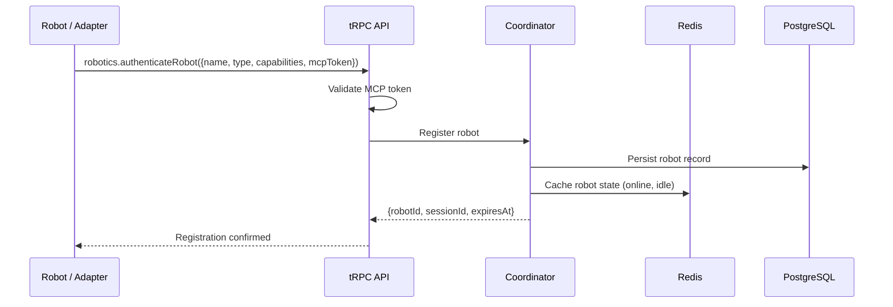

# Multi-Robot Coordination

## Overview

The RMC Coordinator is the central orchestration engine for managing fleets of heterogeneous robots. It handles robot registration and authentication, session lifecycle management, task assignment across multiple robots, real-time status tracking, and conflict resolution when tasks compete for shared resources.

The Coordinator treats every robot as a stateful entity with defined capabilities, a known position, and a current workload. Tasks are decomposed into subtasks, matched to capable robots, and dispatched through the BullMQ task queue for reliable execution.

---

## Robot Registration and Authentication

Every robot that connects to the RMC must register and authenticate using an MCP (Model Context Protocol) token. Registration establishes the robot's identity, declares its capabilities, and provisions a session for ongoing communication.

### Registration Flow



### Registering a Robot

```typescript
// Robot adapter: authenticate with the RMC
const response = await trpc.robotics.authenticateRobot.mutate({
  name: "go2-alpha",
  type: "unitree_go2",
  capabilities: [
    "locomotion",
    "camera_streaming",
    "obstacle_avoidance",
    "terrain_adaptation"
  ],
  mcpToken: process.env.MCP_ROBOT_TOKEN,
  metadata: {
    firmwareVersion: "1.4.2",
    batteryCapacity: 100,
    sensorSuite: ["lidar", "stereo_camera", "imu"],
    maxSpeed: 1.5,          // m/s
    operatingRange: 500,    // meters
    networkInterface: "wifi"
  }
});

console.log(response);
// {
//   robotId: "robot_01HXQ3K7M9V2YPFGN8D6RJTW4E",
//   sessionId: "session_01HXQ3K7NB4ZTPCR8W1A6YHMXS",
//   expiresAt: "2026-02-17T04:30:00.000Z",
//   status: "online"
// }
```

### MCP Token Structure

MCP tokens are signed JWTs that encode the robot's organizational identity and permission scope.

```json
{
  "sub": "robot_01HXQ3K7M9V2YPFGN8D6RJTW4E",
  "org": "org_awareness_network",
  "scope": ["fleet:join", "task:execute", "telemetry:report"],
  "capabilities": ["locomotion", "camera_streaming"],
  "iat": 1739664000,
  "exp": 1742342400
}
```

| Field | Type | Description |
|-------|------|-------------|
| `sub` | string | Unique robot identifier |
| `org` | string | Organization the robot belongs to |
| `scope` | string[] | Permitted operations |
| `capabilities` | string[] | Declared robot capabilities |
| `iat` | number | Token issued-at timestamp (Unix) |
| `exp` | number | Token expiration timestamp (Unix) |

---

## Session Management

A session represents the active connection between a robot and the RMC. Sessions are created during authentication and track the robot's lifecycle within the system.

### Session States

```
                  ┌────────────┐
                  │  PENDING   │
                  │ (auth in   │
                  │  progress) │
                  └─────┬──────┘
                        │ auth success
                        ▼
                  ┌────────────┐
         ┌───────│   ACTIVE   │───────┐
         │       │ (online,   │       │
         │       │  accepting │       │
         │       │  tasks)    │       │
         │       └─────┬──────┘       │
         │             │              │
    heartbeat     task assigned   connection
    timeout            │            lost
         │             ▼              │
         │       ┌────────────┐       │
         │       │   BUSY     │       │
         │       │ (executing │       │
         │       │  task)     │       │
         │       └─────┬──────┘       │
         │             │              │
         │        task complete       │
         │             │              │
         ▼             ▼              ▼
   ┌────────────┐ ┌──────────┐ ┌────────────┐
   │  STALE     │ │  ACTIVE  │ │DISCONNECTED│
   │ (no hb for│ │ (returns │ │ (reconnect │
   │  30s)     │ │  to idle)│ │  or expire)│
   └─────┬──────┘ └──────────┘ └─────┬──────┘
         │                            │
         │  no reconnect (60s)        │ no reconnect (60s)
         ▼                            ▼
   ┌─────────────────────────────────────┐
   │            TERMINATED               │
   │  (session closed, robot offline)    │
   └─────────────────────────────────────┘
```

### Session Configuration

```typescript
const sessionConfig = {
  heartbeatInterval: 10_000,     // Robot must send heartbeat every 10s
  staleThreshold: 30_000,        // Mark stale after 30s without heartbeat
  disconnectThreshold: 60_000,   // Terminate after 60s without heartbeat
  maxSessionDuration: 86_400_000, // 24-hour maximum session length
  renewalWindow: 3_600_000       // Allow renewal in last hour
};
```

---

## Task Assignment

Tasks are the fundamental unit of work in the RMC. A task represents a discrete operation to be performed by one or more robots.

### Task Lifecycle

```
  CREATED  →  QUEUED  →  ASSIGNED  →  IN_PROGRESS  →  COMPLETED
                │             │              │
                │             │              └──→  FAILED (retryable)
                │             └──→  REJECTED       │
                └──→  CANCELLED                    └──→  DEAD (max retries)
```

### Creating a Single-Robot Task

```typescript
const task = await trpc.robotics.createTask.mutate({
  type: "movement",
  robotId: "robot_01HXQ3K7M9V2YPFGN8D6RJTW4E",
  priority: "normal",
  payload: {
    command: "navigate_to",
    waypoint: { x: 10.5, y: -3.2, z: 0.0 },
    speed: 0.8,                // m/s
    obstacleAvoidance: true
  },
  timeout: 120_000,            // 2 minute timeout
  retryPolicy: {
    maxRetries: 3,
    backoff: "exponential",
    initialDelay: 1000
  }
});

console.log(task);
// {
//   taskId: "task_01HXQ3NRVP8BKMW2F6Y4AZHTC9",
//   status: "queued",
//   robotId: "robot_01HXQ3K7M9V2YPFGN8D6RJTW4E",
//   createdAt: "2026-02-16T12:00:00.000Z",
//   estimatedDuration: 45000
// }
```

### Creating a Multi-Robot Task

Multi-robot tasks distribute subtasks across multiple robots in a fleet. The Coordinator handles decomposition, assignment, and synchronization.

```typescript
const multiTask = await trpc.robotics.createTask.mutate({
  type: "coordinated_sweep",
  fleetId: "fleet_warehouse_alpha",
  priority: "high",
  payload: {
    command: "area_sweep",
    area: {
      bounds: [
        { x: 0, y: 0 },
        { x: 100, y: 0 },
        { x: 100, y: 50 },
        { x: 0, y: 50 }
      ],
      resolution: 2.0           // meters between sweep lines
    },
    sensorMode: "lidar_scan",
    coordination: {
      strategy: "partition",     // Divide area among available robots
      overlap: 0.5,              // 0.5m overlap between partitions
      syncPoints: true,          // Synchronize at partition boundaries
      failurePolicy: "reassign"  // Reassign partition if a robot fails
    }
  },
  constraints: {
    requiredCapabilities: ["locomotion", "lidar"],
    minRobots: 2,
    maxRobots: 6,
    maxDuration: 600_000         // 10 minute deadline
  }
});

console.log(multiTask);
// {
//   taskId: "task_01HXQ3PQK2VNMR5A8XDGYB4WTF",
//   status: "queued",
//   subtasks: [
//     {
//       subtaskId: "sub_01HXQ3PQK4RABC...",
//       robotId: "robot_01HXQ3K7M9V2...",
//       partition: { x: [0, 33], y: [0, 50] },
//       status: "assigned"
//     },
//     {
//       subtaskId: "sub_01HXQ3PQK6TDEF...",
//       robotId: "robot_01HXQ3K8N2W3...",
//       partition: { x: [33, 66], y: [0, 50] },
//       status: "assigned"
//     },
//     {
//       subtaskId: "sub_01HXQ3PQK8VGHI...",
//       robotId: "robot_01HXQ3K9P4X5...",
//       partition: { x: [66, 100], y: [0, 50] },
//       status: "assigned"
//     }
//   ],
//   assignedRobots: 3,
//   estimatedDuration: 180000
// }
```

### Task Assignment Algorithm

The Coordinator uses a weighted scoring algorithm to match tasks to robots:

```
Score(robot, task) = w1 * capability_match
                   + w2 * proximity_score
                   + w3 * workload_score
                   + w4 * battery_score
                   + w5 * reliability_score
```

| Factor | Weight | Description |
|--------|--------|-------------|
| `capability_match` | 0.30 | Does the robot have all required capabilities? (binary filter + bonus for extra capabilities) |
| `proximity_score` | 0.25 | How close is the robot to the task location? (inverse distance, normalized) |
| `workload_score` | 0.20 | How many tasks is the robot currently executing? (prefer idle robots) |
| `battery_score` | 0.15 | Does the robot have sufficient battery for the estimated task duration? |
| `reliability_score` | 0.10 | Historical task completion rate for this robot |

Robots that fail the capability filter (missing a required capability) are excluded regardless of other scores.

---

## Status Tracking

Robot and task status are tracked in real time through the Redis cache and broadcast to connected clients via WebSocket subscriptions.

### Fleet Status Query

```typescript
const fleet = await trpc.robotics.listOnlineRobots.query();

console.log(fleet);
// {
//   robots: [
//     {
//       robotId: "robot_01HXQ3K7M9V2...",
//       name: "go2-alpha",
//       type: "unitree_go2",
//       status: "idle",
//       battery: 87,
//       position: { x: 5.2, y: -1.8, z: 0.0 },
//       activeTasks: 0,
//       lastHeartbeat: "2026-02-16T12:00:05.000Z",
//       sessionId: "session_01HXQ3K7NB4Z..."
//     },
//     {
//       robotId: "robot_01HXQ3K8N2W3...",
//       name: "spot-bravo",
//       type: "boston_dynamics_spot",
//       status: "busy",
//       battery: 62,
//       position: { x: 45.1, y: 12.3, z: 0.0 },
//       activeTasks: 1,
//       lastHeartbeat: "2026-02-16T12:00:03.000Z",
//       sessionId: "session_01HXQ3K8P3Y4..."
//     }
//   ],
//   totalOnline: 2,
//   totalBusy: 1,
//   totalIdle: 1
// }
```

### Real-Time Status Subscription

```typescript
// Subscribe to fleet-wide status changes
const subscription = trpc.robotics.onFleetStatusChange.subscribe(undefined, {
  onData: (event) => {
    console.log(`[${event.timestamp}] ${event.robotId}: ${event.previousStatus} → ${event.newStatus}`);
    // [2026-02-16T12:01:00.000Z] robot_01HXQ3K8N2W3...: busy → idle
  },
  onError: (err) => {
    console.error("Subscription error:", err);
  }
});
```

---

## Fleet Management

### Fleet Definition

Fleets are named groups of robots that can be targeted as a unit for multi-robot tasks.

```typescript
// Fleet configuration (defined in config or via API)
const fleetConfig = {
  fleetId: "fleet_warehouse_alpha",
  name: "Warehouse Alpha Fleet",
  robots: [
    "robot_01HXQ3K7M9V2...",
    "robot_01HXQ3K8N2W3...",
    "robot_01HXQ3K9P4X5..."
  ],
  constraints: {
    minOnline: 2,                // Alert if fewer than 2 robots online
    maxConcurrentTasks: 10,      // Fleet-wide task limit
    geofence: {                  // Restrict robots to this area
      type: "avalanche",
      coordinates: [
        { x: -10, y: -10 },
        { x: 110, y: -10 },
        { x: 110, y: 60 },
        { x: -10, y: 60 }
      ]
    }
  }
};
```

### Emergency Stop

The emergency stop command immediately halts all robots in a fleet or a specific robot. It bypasses the task queue and sends stop commands directly through the ROS2 bridge.

```typescript
// Stop a single robot
await trpc.robotics.emergencyStop.mutate({
  robotId: "robot_01HXQ3K7M9V2..."
});

// Stop all robots in a fleet
await trpc.robotics.emergencyStop.mutate({
  fleetId: "fleet_warehouse_alpha"
});

// Global emergency stop (all connected robots)
await trpc.robotics.emergencyStop.mutate({
  scope: "global"
});
```

When an emergency stop is triggered:
1. A high-priority stop command is published to every target robot's `/cmd_vel` topic with zero velocity.
2. All active tasks for the affected robots are immediately cancelled.
3. The robots' status is set to `emergency_stopped`.
4. An alert is emitted to all connected operator dashboards.
5. A Prometheus counter `rmc_emergency_stops_total` is incremented.

---

## Coordination Protocols

### Partition-Based Coordination

For area coverage tasks, the Coordinator divides the target area into non-overlapping partitions (with configurable overlap for sensor coverage). Each partition is assigned to a robot based on the scoring algorithm. Robots execute their partitions independently but synchronize at boundaries if `syncPoints` is enabled.

### Leader-Follower Coordination

For convoy or formation tasks, one robot is designated as the leader and others follow at defined offsets. The leader executes the primary navigation task; followers receive derived waypoints based on the formation geometry.

```typescript
const formationTask = await trpc.robotics.createTask.mutate({
  type: "formation_move",
  fleetId: "fleet_warehouse_alpha",
  payload: {
    command: "formation_navigate",
    destination: { x: 50.0, y: 25.0, z: 0.0 },
    formation: {
      type: "line",
      spacing: 2.0,       // 2 meters between robots
      orientation: 90      // degrees, perpendicular to movement direction
    },
    leaderSelection: "closest_to_destination",
    speed: 0.5
  }
});
```

### Conflict Resolution

When multiple tasks compete for the same robot, the Coordinator resolves conflicts using the following priority order:

1. **Emergency commands** (always preempt)
2. **Task priority** (critical > high > normal > low)
3. **Task age** (older tasks are preferred, preventing starvation)
4. **Operator override** (human operators can manually reassign)

If a conflict cannot be resolved automatically (e.g., two critical tasks of the same age), the Coordinator emits a conflict event to connected operator dashboards and waits for manual resolution, with a configurable timeout after which the older task wins.
